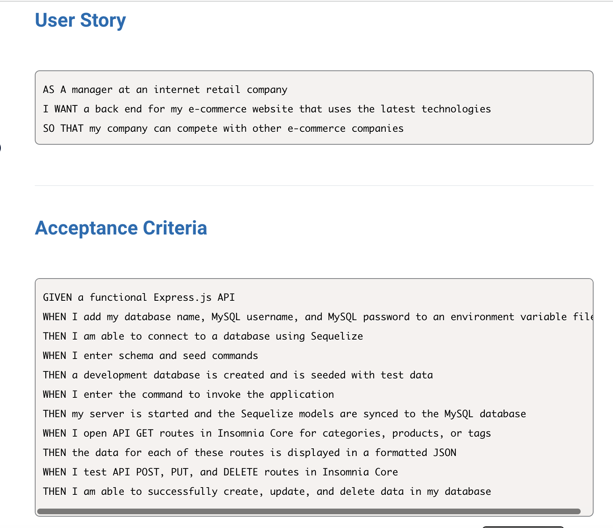
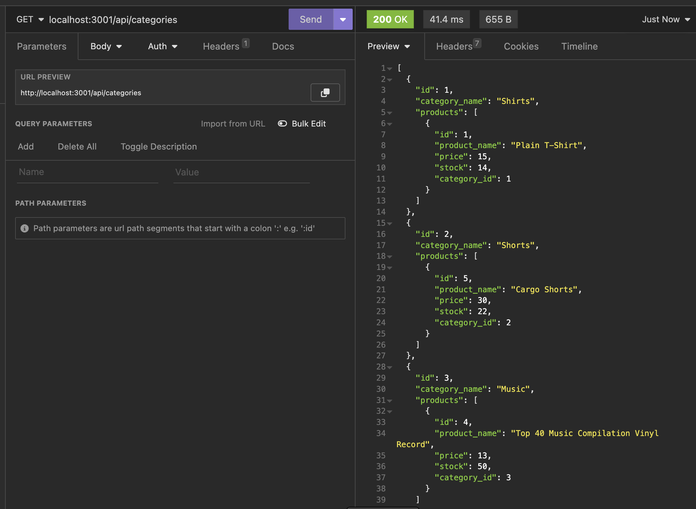
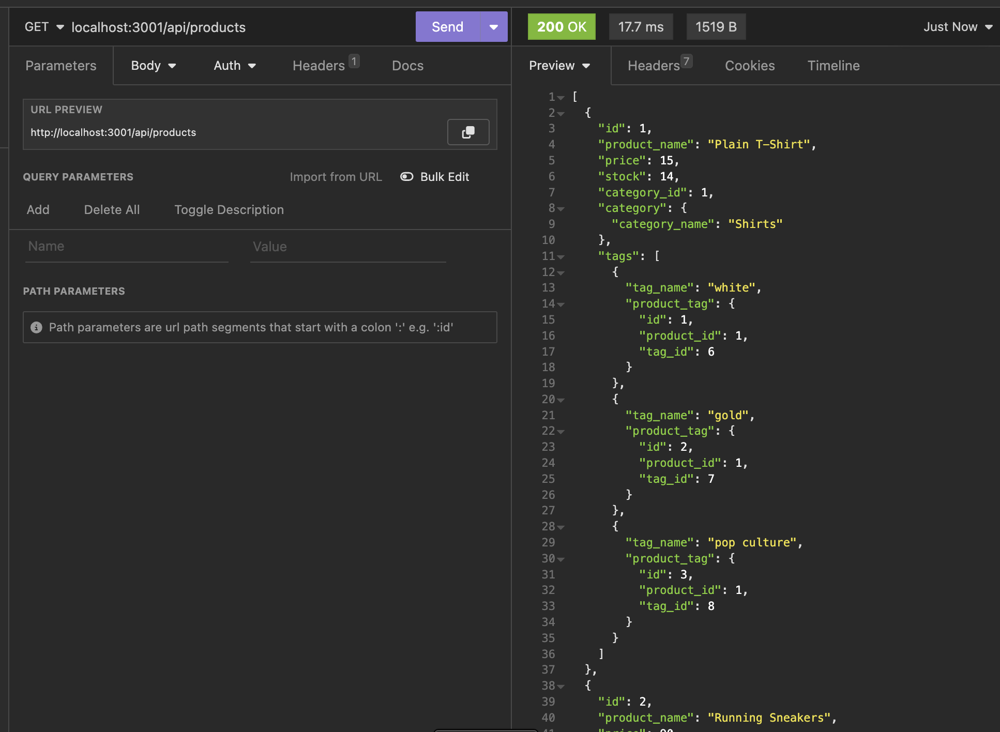
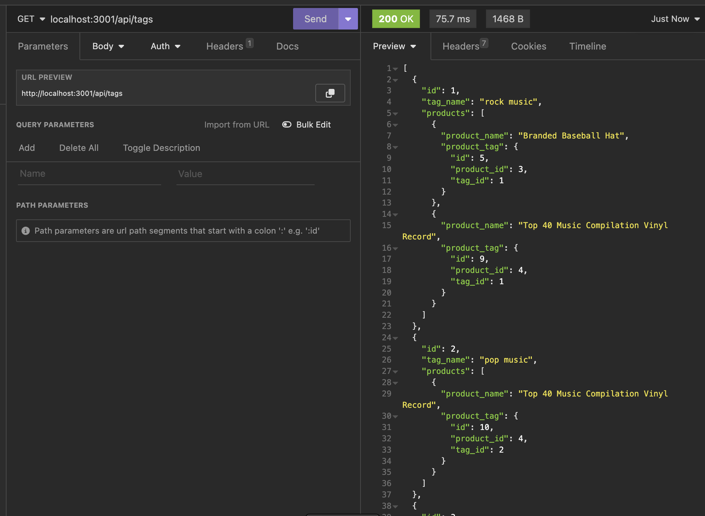

# E-Business Back-End

Dynamical back-end for your business!

## Description

This program allows for full CRUD functionality of a databse containing 3 tables, categories, products and tags, in the backend.

User Story: 

## Summary

This is the back end for an e-commerce site that uses Express.js API and Sequelize to interact with a MySQL database.
This is Easy-to-use back-end application that manages database of online store.

## Installation / Usage

This is used to dynamically manage a e-commerce backend consisting of categories, products and tags.

In order to install you need to Clone this repository to your local machine so you can use the application.

Step 1 --> Clone Repository

Step 2 --> Run npm install in your terminal.

Step 3 --> You will need to create your own .env file with your inputs to connect to the DB. 

Step 4 --> Run MySQL -u root -p to access the MySQL CLI. Run source schema.sql in your MySQL terminal to create the Database. (Then Exit)

Step 5 --> Run npm run seeds to seed the databse.

Step 6 --> Run npm start. 

Step 7 --> Open Insomnia and make API request. 

## License

MIT License

## Author

Dilek Nuredin

https://github.com/dileknrdn 
